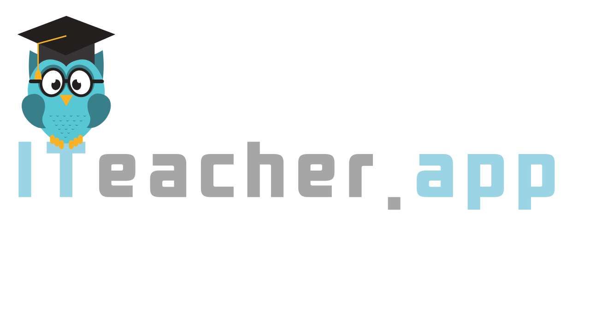

# **iTeacher - O Conhecimento inclui**

---

> Plataforma multilateral para professores.

- Nossa missão

  - Fomentar o empreendedorismo, em áreas de risco social (com a plataforma) e compartilhar conhecimento e tecnologia (curso) para pessoas em risco social que queiram empreender com tecnologia

---

> ### Instalação

- clonar o o repositório

  - git clone https://github.com/LuizPiresS/iteacher-back.git
  - npm install
  - docker-compose up -d (sobe o banco de dados)
  - npx prisma migrate dev (roda as migrations)
  - npm run start:dev

- Depois de cada modificação no banco de dados rodar
  - npx prisma generate

> ### Modelo de negócios

- [Modelo de negócios proposto](https://miro.com/app/board/o9J_kqWCpbw=/)

> ### Bibliotecas e ferramentas utilizadas

- [Husky](https://github.com/typicode/husky)
- [Lint-staged](https://github.com/okonet/lint-staged)
- [Github Actions](https://github.com/features/actions)
- [Docker](https://www.docker.com/)
- [NestJS](https://nestjs.com/)
- [Prisma](https://www.prisma.io/)
- [Jest](https://jestjs.io/)

> ### Features
